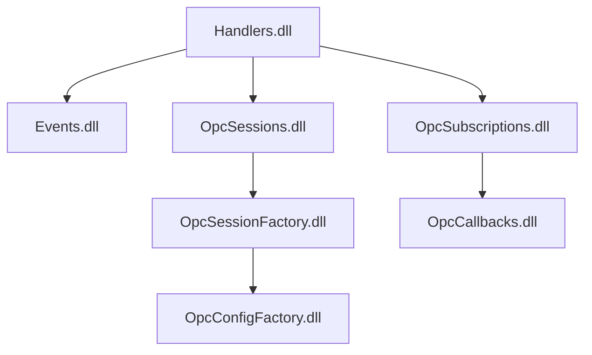

# Potapich.OpcUaNetStandard  
High-performance OPC UA client library for .NET with event-driven architecture, dependency injection support, and flexible subscription management.

[](https://www.nuget.org/packages/Potapich.OpcUaNetStandard)
[](https://github.com/potapich1978/OpcUaNetStandard/actions)


## Origins & Background
This library has an interesting origin story. For many years, I relied on Kepware's ClientAce libraries for OPC UA connectivity. I must give credit where it's due - their package served us reliably and performed without issues through countless production deployments. However, as with any commercial solution, licensing costs were a consideration, and when our licenses were approaching expiration, I began evaluating alternatives.

I wondered if the open-source ecosystem had matured enough to provide viable OPC UA solutions since I last evaluated options years ago. To my pleasant surprise, I discovered the excellent **[OPCFoundation.NetStandard.Opc.Ua.Client](https://www.nuget.org/packages/OPCFoundation.NetStandard.Opc.Ua.Client/)** package from the OPC Foundation team - a robust, well-maintained open-source implementation that met our core requirements.

Around the same time, I had been developing and publishing my own event channel implementation **[Potapich.EventFlowChannel](https://www.nuget.org/packages/Potapich.EventFlowChannel/)** which provided a clean abstraction for message processing pipelines. The idea emerged to combine these two components: leveraging the solid OPC Foundation client for the protocol implementation while using my event channel package to manage the subscription.

**Why Event Channels?**
For those skeptical about the channel-based approach, consider these advantages:

**Traditional OPC UA clients** typically use callback mechanisms where:
- Notification handlers run on I/O threads, potentially blocking communication
- Limited control over threading and resource utilization
- Difficult to implement backpressure and flow control
- Complex error handling and recovery scenarios

**The channel-based architecture** provides:
- **Built-in concurrency management**: Separate readers/writers with configurable parallelism
- **Decoupled processing**: I/O operations separated from business logic
- **Backpressure support**: Automatic flow control when consumers can't keep up
- **Resource management**: Controlled memory usage with bounded channels
- **Fault isolation**: Errors in one handler don't crash the entire client
- **Enhanced observability**: Clear pipeline for monitoring and diagnostics

The event channel acts as a managed message queue that sits between the OPC UA layer and your application logic, providing a buffer that absorbs bursts of data and allows for controlled, predictable processing.


The result is this integrated solution that maintains the reliability we needed while offering modern .NET patterns, dependency injection support, and a more flexible architecture. If you're facing similar challenges with commercial OPC licensing or simply prefer open-source solutions, this package might provide the alternative you're looking for.


## Dependencies

| Package | Purpose |
|---------|---------|
| **Potapich.EventFlowChannel** | Event channel implementation for async event pipelines |
| **OPCFoundation.NetStandard.Opc.Ua.Client** | Official OPC UA client implementation |


## Key Features
- **Event-Driven Architecture** – Dispatcher pattern for OPC UA subscriptions  
- **Multi-Platform Support** – Compatible with .NET Standard 2.0 through .NET 9  
- **Dependency Injection Ready** – Seamless integration with Microsoft.Extensions.DependencyInjection  
- **Advanced Subscription Management** – Multiple callbacks per monitored item  
- **Automatic Session Recovery** – Reconnection and keep-alive mechanisms  
- **Thread-Safe Operations** – Safe concurrent subscription and callback handling  


## Best Practices
- **Session Reuse**: Reuse sessions for the same endpoint whenever possible  
- **Callback Management**: Always unregister callbacks when no longer needed  
- **Error Handling**: Implement robust error handling in your callbacks  
- **Resource Cleanup**: Properly dispose of sessions when shutting down  

# Architecture Overview



### Event Dispatcher Pattern
Three main event types drive the system:
- **RegisterSession** – Establishes a new OPC UA session  
- **AddItemToSubscription** – Adds a monitored item to a subscription  
- **RemoveItemFromSubscription** – Removes a monitored item from a subscription  

### Core Components
- **OpcSessionsManager** – Manages OPC UA session lifecycle  
- **OpcSubscriptionsManager** – Handles subscriptions and monitored items  
- **OpcCallbacksManager** – Supports multiple callbacks per OPC tag  
- **OpcConfigurationManager** – Manages client configuration  


## Installation
```xml
<PackageReference Include="Potapich.OpcUaNetStandard" Version="1.0.0" />
```

# Quick Start
## Implement Logger
```cs
internal class MyLogger : IGenericEventDispatcherLogger
{
    public void LogError(string message) => Console.WriteLine(message);
    public void LogError(string message, Exception exception) => Console.WriteLine($"Error: {exception}");
    public void LogWarning(string message) => Console.WriteLine(message);
}
```
## Configure Services
```cs
var provider = new ServiceCollection()
    .AddSingleton<IGenericEventDispatcherLogger, MyLogger>()
    .AddOpcBackend()
    .BuildServiceProvider();
```

## Initialize Channel
```cs
var channelBuilder = provider.GetRequiredService<IChannelBuilder<OpcCommandEvent>>();

var opcChannel = channelBuilder
    .Unbounded()
    .WithMultipleWriters()
    .WithReadersCount(1)
    .Build();

opcChannel.Start();
```

## Manage OPC Sessions and Subscriptions
```cs
const string endpoint = "opc.tcp://your-server:49320";
const string tagId = "ns=2;s=Your.Tag.Identifier";
const string appId = "your-client-app";

// Create session
await opcChannel.Enqueue(new RegisterSession(appId, endpoint));

// Add subscription with callback
await opcChannel.Enqueue(new AddItemToSubscription(
    appId, 
    tagId, 
    "callback-key", 
    (item, e) => 
    {
        foreach (var value in item.DequeueValues())
            Console.WriteLine($"{DateTime.Now:HH:mm:ss} {item.DisplayName} = {value.Value}");
    }
));

// Remove subscription
await opcChannel.Enqueue(new RemoveItemFromSubscription(appId, tagId, "callback-key"));
```
### Console Output
```text
12:31:02 Your.Tag.Identifier = 42
12:31:03 Your.Tag.Identifier = 43
```


